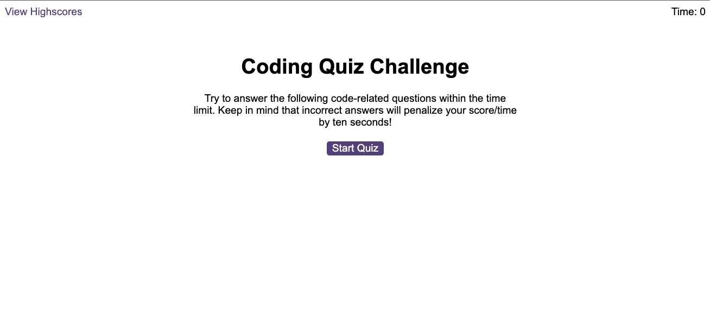
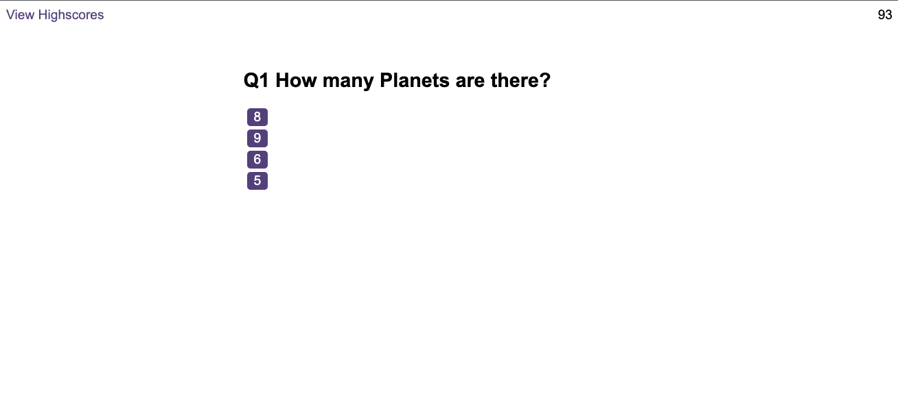
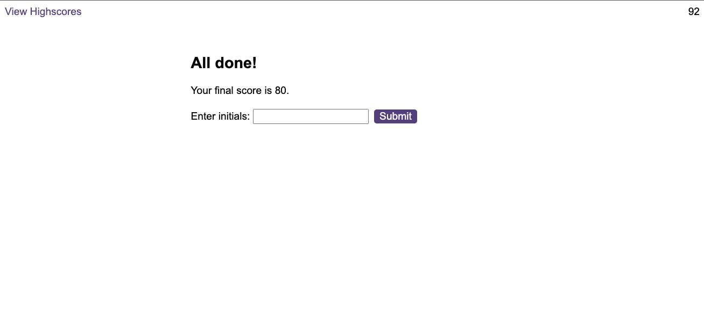

# hits-Quiz

## Task
I had to build a timed coding quiz with multiple-choice questions. This app will run in the browser, and will feature dynamically updated HTML and CSS powered by JavaScript code that I write. It will have a clean, polished, and responsive user interface.

## Approach

I used the activites and help from the assistance for this task. Going over the activites and doing some extra google search helped with this task. I used external websites like stack-overflow, mdm, and chatgpt etc. These tools helped me develop the code I have so far. 

## Github page link
https://hitesh70738.github.io/hits-Quiz/

## Conclusion

This weeks challenege has been one of the most difficult to attempt. The logic makes sense and certain parts click. For example getting the timer to work, and subtract time of it. But there are simply too many moving parts to get my head around. I understand the logic but the final piece is lacking some functionality of the site. 

## Screenshot

